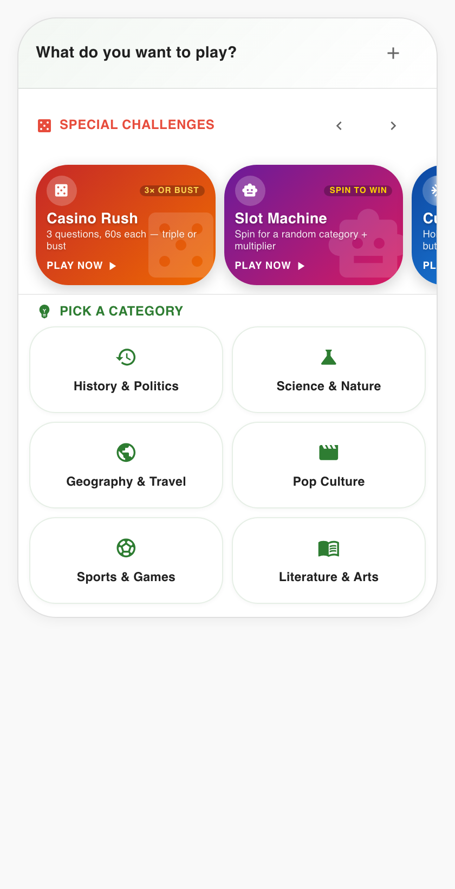
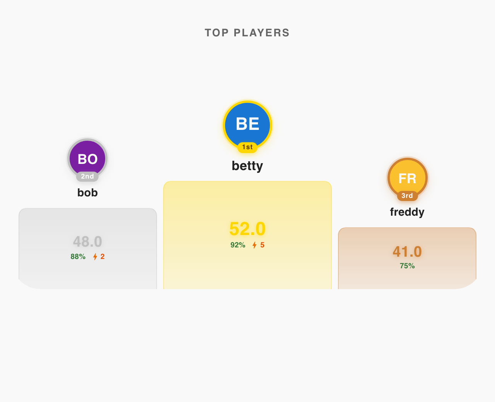
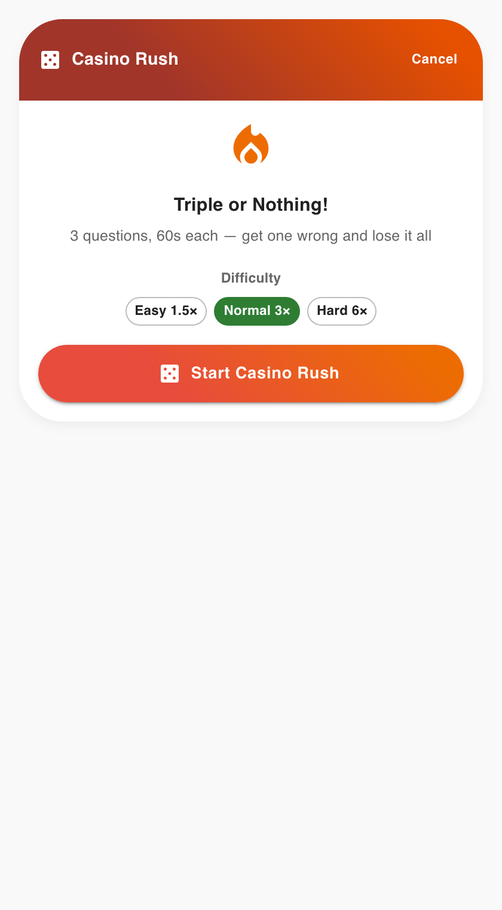
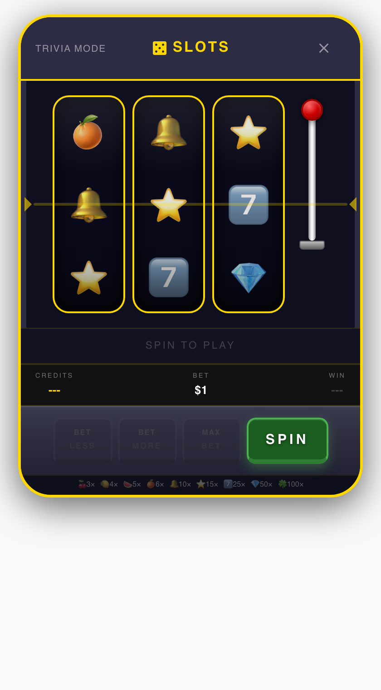
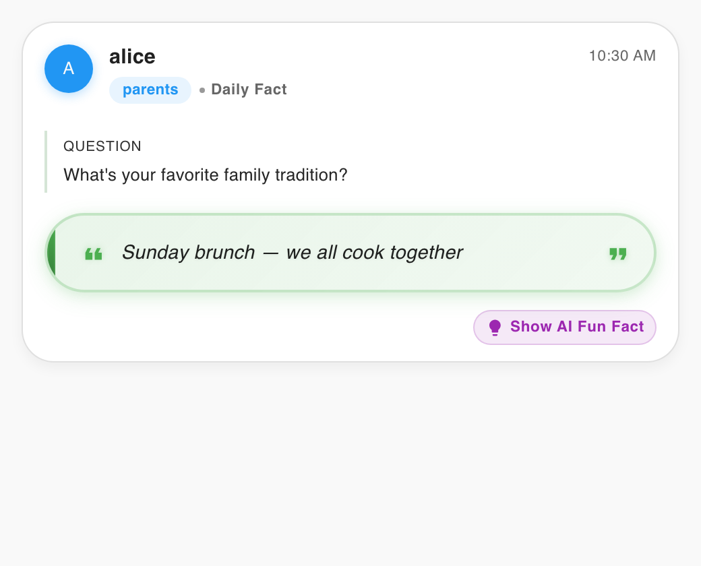
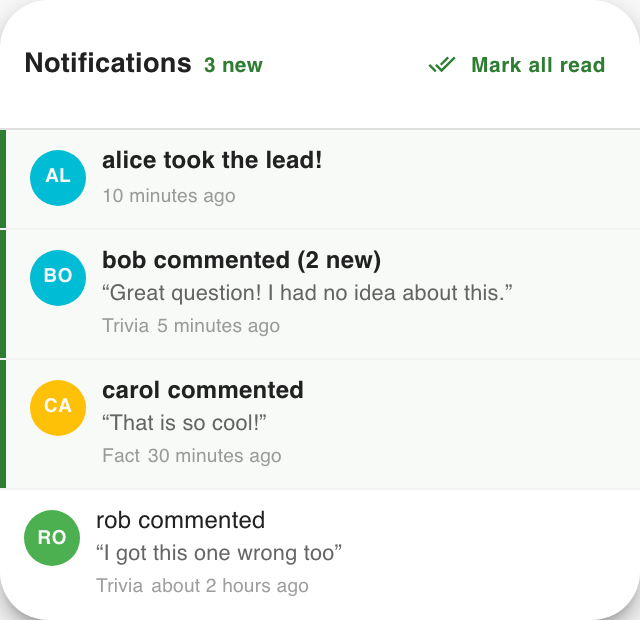
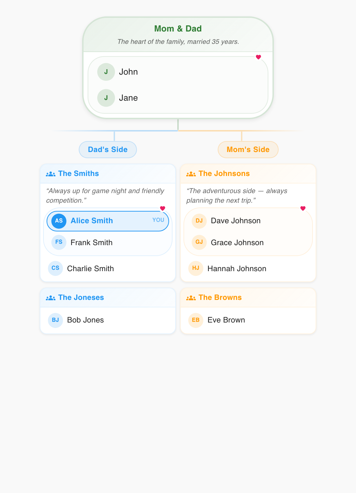

# Family Trivia

> _"Assume everyone is trying their best, and be kind to each other."_
> — Christina Baker Kline

AI-powered daily trivia, facts, and mini-games for families — built with React, AWS CDK, and Claude on Bedrock.

---

## In memory of…

<div align="center">

**Elizabeth "Betty" D'Hondt**

_1946 — 2026_

_She cared deeply, for every creature, for every story,_
_with a heart as big as the elephants she loved._

</div>

This project started as a way to stay connected with my mom. After retirement, as her physical health declined, I watched depression slowly take more of her light. I'd sit with her, listen, try to be there — sometimes love looks like a hard balance between helping, giving space, and simply showing up. Family Trivia gave her something to do every morning, gave us something to talk about, and helped us capture more memories of our family, together.

May is **#MentalHealthMonth** 💚. Mental health struggles can be quiet — isolation, loss of identity, feeling like a burden when you're deeply loved. Check in, sit awhile, and make space for the conversations that matter. Let's have more good days, together.

Resources: [mhanational.org/may](https://mhanational.org/may)

**#WordsToRememberForNana**

---

## What it does

- **Daily Trivia** — One AI-generated question per day per player, with catch-up mode for missed days.
- **Daily Facts** — Share personal facts with the family. Weekly AI summaries.
- **Game Modes** — Casino Rush, Slot Machine, Curling, Tetris. Each earns a trivia score multiplier.
- **Arcade** — Same games, unlimited play, high-score leaderboards.
- **Family Feud** — Rotating "how well do you know me?" rounds.
- **Leaderboard** — Season-based scoring, individual + team rankings.
- **Notifications** — Comments, high scores, leader changes, Family Feud results.
- **Timeline** — Scrollable feed of everyone's answers and facts, with threaded comments.

## A look at it

|  |  |
|---|---|
|  |  |
| **Daily trivia & game-mode carousel** — pick a category or jump into a special challenge. | **Top players** — season-based podium with score, accuracy, and streak. |
|  |  |
| **Casino Rush** — 3 questions, 60s each. Triple-or-bust difficulty multipliers. | **Slot Machine** — spin a random category and multiplier. |
|  |  |
| **Daily Facts** — share something about yourself. AI generates a fun-fact follow-up. | **Notifications** — comments, leader changes, Family Feud results. |



_Screenshots are captured from Storybook stories — see [`scripts/screenshot-stories.mjs`](scripts/screenshot-stories.mjs) to regenerate._

## Game modes

| Mode | What it is | Cooldown |
|------|------------|----------|
| **Casino Rush** | 3 questions, 60s each — triple or bust | 1 week |
| **Slot Machine** | Spin for a random category + multiplier | 1 week |
| **Curling** | Hold and release — land on the button | 1 week |
| **Tetris** | 60s to clear lines, score your multiplier | 1 week |

## Architecture

```
CloudFront (CDN)
├── /*     → S3 (React frontend)
└── /api/* → API Gateway → Lambda (Node.js/TS)
                              ├── S3 (data storage — JSON, no DB)
                              └── Bedrock (Claude Sonnet + Haiku)
```

- **Frontend**: React + TypeScript + Material UI + Vite
- **Backend**: Single Lambda function with route handlers
- **Infrastructure**: AWS CDK (TypeScript)
- **AI**: Amazon Bedrock — Claude Sonnet for generation, Claude Haiku for fact-checking
- **Shared Types**: `shared/` package (`@family-trivia/shared`)
- **Storage**: S3 JSON files — no database needed

## Prerequisites

- **AWS account** with Bedrock access (Claude models enabled in `us-east-1`)
- **Node.js 18+** and npm
- **Google Cloud Console** project with an OAuth 2.0 client ID
- **Custom domain** (optional) with an ACM certificate in `us-east-1`

## Quick start

```bash
# 1. Clone and install
git clone https://github.com/yeahthisisrob/family-trivia.git
cd family-trivia
npm install

# 2. Configure
cp cdk/cdk.context.example.json cdk/cdk.config.json
cp frontend/public/config.example.json frontend/public/config.local.json
# Edit both — see Configuration below

# 3. Build shared types + frontend
cd shared && npm run build && cd ..
cd frontend && npm run build && cd ..

# 4. Deploy infrastructure
cd cdk && npx cdk deploy

# 5. Open the CloudFront URL CDK printed.
#    The first-run wizard walks you through creating your family,
#    adding members, and starting a season.
```

## Configuration

`cdk/cdk.config.json` (gitignored — copy from `cdk.context.example.json`):

| Key | Description |
|-----|-------------|
| `googleClientId` | Google OAuth 2.0 client ID |
| `jwtSecret` | Random hex string — generate with `openssl rand -hex 32` |
| `certificateArn` | ACM certificate ARN for custom domain (optional) |
| `customDomain` | Your domain, e.g. `trivia.example.com` (optional) |
| `bedrockModelId` | Claude model ID (defaults to Sonnet) |

`frontend/public/config.local.json` (gitignored — copy from `config.example.json`): runtime URL config for the React app.

## Development

```bash
# Frontend dev server
cd frontend && npm run dev

# Storybook (component playground with MSW API mocks)
cd frontend && npm run storybook

# Type-check + lint
cd frontend && npm run lint -- --fix && npm run typecheck

# Lambda tests
cd cdk/lambda && npm test
```

## Project structure

```
cdk/                    AWS CDK infrastructure
  lib/                  Stack definition
  lambda/               Backend code
    routes/             API handlers
    services/           Business logic
frontend/               React app
  src/components/       UI components
  src/api/              API client
  src/contexts/         State management
  .storybook/           Storybook + MSW mocks
shared/                 Shared TypeScript types
```

## Contributing

See [CONTRIBUTING.md](CONTRIBUTING.md). PRs welcome, especially anything that helps families connect.

## License

[MIT](LICENSE) © 2026 Rob D'Hondt

---

_Built with love. In memory of Mom._ 💚
